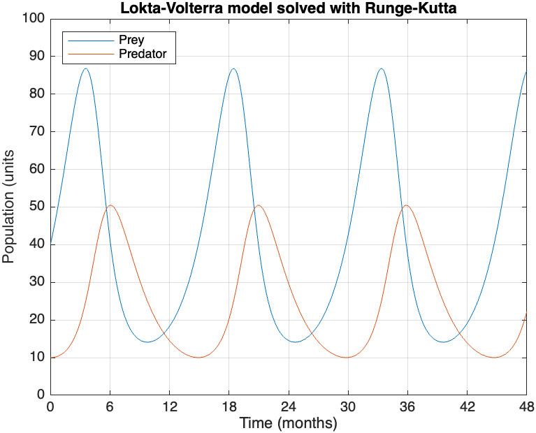

# Documentation

## Introduction

This repository is meant as an introduction into dynamical systems modelling, as well as its computational simulation. It will focus on ecological modelling, and mainly on numerical ODE solvers for the simulations. The aim is to provide both explanations and comparisons of basic ODE solvers (Euler, RK4,...), as well as some basic models for predator-prey relationships.

## The Lotka-Volterra model

The simplest model for predator-prey relationships is the Lotka-Volterra model. It assumes two species with populations $x_1,x_2$ respectively, where $x_1$ is the prey and $x_2$ the predator. The evolution of the populations is given by the following ODE.

$$
\frac{dx_1}{dt}=a x_1-bx_1x_2 \\
\frac{dx_2}{dt}= c x_1x_2-dx_2
$$

where

- $a$: Prey reproduction rate
- $b$: Depredation rate
- $c$: Predator reproduction rate
- $d$: Predator death rate

For any set of initial conditions (real and positive), the model will generally show out of sync oscillations, with predator populations peaking after the prey populations. Despite not having a closed form solution, the behavior is generally stable, and is non-stiff for moderate values for the parameters. Therefore, it will be used as a benchmark to compare the various numerical solvers used in further sections.

The `LotkaVolterra.mlx` notebook inside the Notebooks folder shows some simulations using various methods, and parameters can be tweaked to see how the model reacts. By taking the following assumptions,

- Prey grows by 50% monthly in absence of predators
- 0.02 Prey encounters per month per predator
- 1% Predator efficiency (in converting prey into offspring)
- Predator population declines by 50% monthly in absence of prey
- Initial population of 40 prey and 10 predators

the resulting simulation (using RK4, 1000 timesteps) is

## ODE solvers comparison over Lotka-Volterra
