# Documentation

## Introduction

This repository is meant as an introduction into dynamical systems modelling, as well as its computational simulation. It will focus on ecological modelling, and mainly on numerical ODE solvers for the simulations. The aim is to provide both explanations and comparisons of basic ODE solvers (Euler, RK4,...), as well as some basic models for predator-prey relationships.

## The Lotka-Volterra model

The simplest model for predator-prey relationships is the Lotka-Volterra model. It assumes two species with populations $x_1,x_2$ respectively, where $x_1$ is the prey and $x_2$ the predator. The evolution of the populations is given by the following ODE.

$$
\begin{matrix}
\frac{dx_1}{dt}=a x_1-bx_1x_2 \\
\frac{dx_2}{dt}= c x_1x_2-dx_2
\end{matrix}
$$

where

- $a$: Prey reproduction rate
- $b$: Depredation rate
- $c$: Predator reproduction rate
- $d$: Predator death rate

For any set of initial conditions (real and positive), the model will generally show out of sync oscillations, with predator populations peaking after the prey populations. Despite not having a closed form solution, the behavior is generally stable, and is non-stiff for moderate values for the parameters. Therefore, it will be used as a benchmark to compare the various numerical solvers used in further sections.

The `LotkaVolterra.mlx` notebook inside the Notebooks folder shows some simulations using various methods, and parameters can be tweaked to see how the model reacts. By taking the following assumptions,

- Prey grows by 50% monthly in absence of predators
- 0.02 Prey encounters per month per predator
- 1% Predator efficiency (in converting prey into offspring)
- Predator population declines by 40% monthly in absence of prey
- Initial population of 40 prey and 10 predators

the resulting simulation (using RK4, 1000 timesteps) is

### Lotka-Volterra equilibrium points

By setting the time derivatives to 0, equilibrium points for the model can be found. In this case,

$$
\begin{rcases}
0 =ax_1-bx_1x_2 \\
0=cx_1x_2-dx_2
\end{rcases}
\implies \begin{cases}
x_1=x_2=0 \\
x_1=\frac dc,\quad x_2=\frac ab
\end{cases}
$$

It is trivial to verify that for those pairs of initial conditions, the system will remain at equilibrium.

## ODE solvers comparison over Lotka-Volterra

Due to this model not having a closed form solution, self-convergence tests will be used. In this case, Richardson convergence analysis will be used, where succesively precise iterations are compared, in order to obtain an aproximation of the theoretical convergence order. The aproximate convergence order is given by

$$
p= \frac{\log \left(\frac{\|x_h - x_{h/2}\|}{\|x_{h/2} - x_{h/4}\|}\right)}{\log 2}
$$

A function is defined (in the `NumericalComparison.mlx`notebook) to, given $N$ and $iter$, calculate succesive iterations using $N,2N,4N,...$ steps, and get $iter$ different aproximations for the convergence orders.

Taking 10 initial timesteps, and doubling each iteration, the convergence orders are the following.

| Method         | Value 1 | Value 2 | Value 3 | Value 4 | Value 5 |
|----------------|---------|---------|---------|---------|---------|
| Euler          | 1.5680  | 1.2603  | 1.1420  | 1.0729  | 1.0378  |
| AdamsBashfort  | 1.9568  | 2.0980  | 1.9917  | 1.9872  | 1.9907  |
| RK4            | 3.9980  | 3.9791  | 3.9678  | 3.9832  | 3.9915  |
| DormandPrince  | 6.5154  | 5.8117  | 5.5196  | 5.3225  | 5.1860  |

The main limitation of this testing method is that, if variable precission arithmetic is not used, the higher order methods' calculations will eventually collapse, due to rounding error dominating over the method's error.

Compute time can also be compared for these methods. Despite the higher order methods having higher compute times (~5x at worst case), the massive precision increase is almost always worth it, due to the error being various orders of magnitude smaller. The results, for the implementations in this repository are the following.

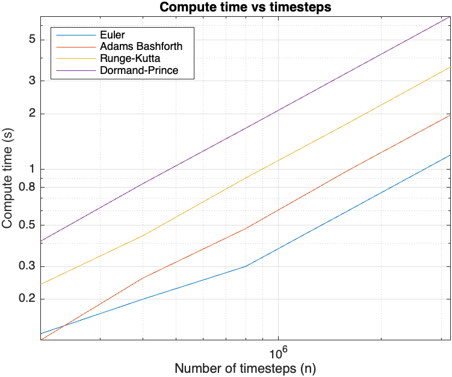

## Logistic prey growth

As it has been found on the previous section, the compute cost of higher order methods is justifiable, so from now on, most simulation will onle be run on Runge-Kutta (RK4) or Dormand-Prince (DOPRIS5). The next simplest modification that can be done to the Lotka-Volterra model is to model prey evolution (in absence of predators), using logistic growth. This way, a carrying capacity $K$ can for the system can be added, so as prey population approaches it, its growth rate slows down, to simulate the decreasing resource availability. Once this aspect is considered, the resulting ODE is as follows

$$
\begin{matrix}
\frac{dx_1}{dt}=a x_1(1-\frac{x_1}{K})-bx_1x_2 \\
\frac{dx_2}{dt}= c x_1x_2-dx_2
\end{matrix}
$$

where

- $a$: Prey reproduction rate
- $b$: Depredation rate
- $c$: Predator reproduction rate
- $d$: Predator death rate
- $K$: Carrying capacity

### Logistic model equilibrium points

By setting the time derivatives to 0, the equilibrium points can be found.

$$
\begin{rcases}
0 =ax_1(1-\frac{x_1}K)-bx_1x_2 \\
0=cx_1x_2-dx_2
\end{rcases}
\implies \begin{cases}
x_1=x_2=0 \\
x_1=K,\quad x_2=0 \\
x_1=\frac dc,\quad x_2=\frac ab(1-\frac{d}{cK})
\end{cases}
$$

### Numerical simulation (Logistic growth)

By using the same parameters as before, but adding a carrying capacity, the model behavior changes, and now shows damped oscillations around the equilibrium points for the system. This shows how reducing growth rate when population approaches the carrying capacity adds a damping factor that stabilizes behavior. Simulating with Runge-Kutta, the following results are found.

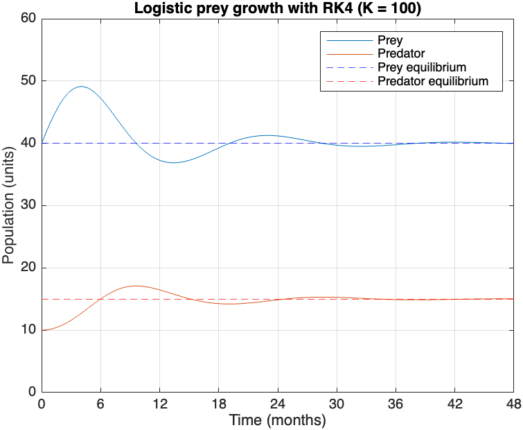

## Predator functional response

Once prey growth rate has been limited, the next step to improve the current model, is to limit predator growth. Right now, sufficiently big prey populations would increase predator growth rate regardless of predator population. The equivalent to logistic growth, but applied to predator growth rate would be to add a functional response, so predator growth rate is capped by predator population. This makes ecological sense, because a point would be reached where increasing prey population would not further increase predator growth rate, as predators would be saturated (limited by reproduction or digestion rate). The functional response used in this implementation will be the Type II response, which will lead to the Holling Type II model.

This response is given by

$$
f(R)=\frac{aR}{1+ahR}
$$

where

- $f(R)$: Denotes the consumption rate (per user)
- $a$: Denotes the attack rate
- $R$: Denotes  a resource (prey in this case)
- $h$: Denotes the handling rate

Assymptotically, it tends to $\frac 1h$, representing how for abundant prey, the predators will saturate at the reciprocal of the handling time. For example, for a handling time of 0.5 units (months per example), the prey consumption rate for sufficiently abundant prey will be 2 units per month. As prey population decreases, the actual consumption rate will be lower. By incorporating this factor, the resulting model is the Holling Type II model, given by the following ODE

$$
\begin{matrix}
\frac{dx_1}{dt}=a x_1(1-\frac{x_1}{K})-\frac{bx_1}{1+hbx_1}x_2 \\
\frac{dx_2}{dt}= c \frac{bx_1}{1+hbx_1}x_2-dx_2
\end{matrix}
$$

where

- $a$: Prey reproduction rate
- $b$: Depredation rate
- $c$: Predator reproduction rate
- $d$: Predator death rate
- $K$: Carrying capacity
- $h$: Predator handling rate

### Holling type II equilibrium points

Setting both time derivatives to 0, the equilibrium points are the following

$$
\begin{rcases}
0=a x_1(1-\frac{x_1}{K})-\frac{bx_1}{1+hbx_1}x_2 \\
0= c \frac{bx_1}{1+hbx_1}x_2-dx_2
\end{rcases}
\implies \begin{cases}
x_1=x_2=0 \\
x_1=K,\quad x_2=0 \\
x_1=\frac{d}{b(c-hd)},\quad x_2=-\frac{ac(d-bcK+bdhK)}{b^2(c-dh)^2K}
\end{cases}
$$

### Numerical simulation (Holling Type II)

When adding the predator handling time, with a handling time of 0.2 (6 days), the results are the following.

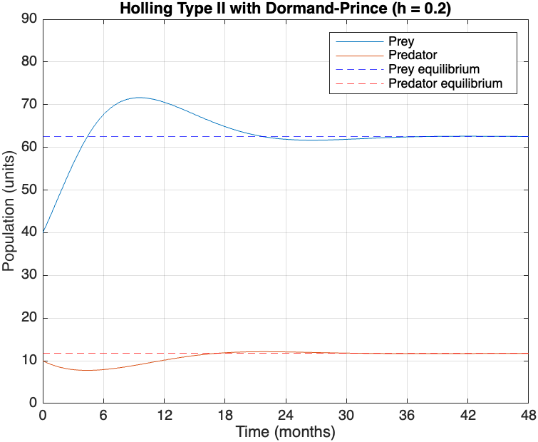

This code is available in the `FunctionalResponse.mlx` notebook, to be able to modify the parameters and see how the model reacts.

## Seasonality (non autonomous ODEs)

While these simulations can accurately model predator-prey dynamics in stable environments (tropical climates for example), they fail to portray the big effect seasonality can have on ecological dynamics. Thus, the next logical step is to add a non-autonomous term to the ODE, in order to model this phenomenon. This can be easily done by replacing any of the constants in any of the previous model, by a time dependent (usually periodic) function. In this case, the prey growth rate $a$ will be. changed to a function $a(t)$ given by

$$
a(t)=A\left(0.5+\cos^2\left(\frac{\pi t}{12}\right)\right)
$$

Note how the average value for the function will still be $A$, and the function is periodic with a period of 12 (a year).

The rest of the model will be the same, but replacing the constant for the function. Note how now, equilibrium points will not exist, as they will constantly vary depending on the value of $a(t)$. However, if the previous equilibrium lines are plotted, they still correspond to the values around which the populations hover, due to the time averages being the same.

### Numerical simulation (Seasonal Growth)

Once the seasonal term is added, the results, while keeping the rest of the parameters the same are

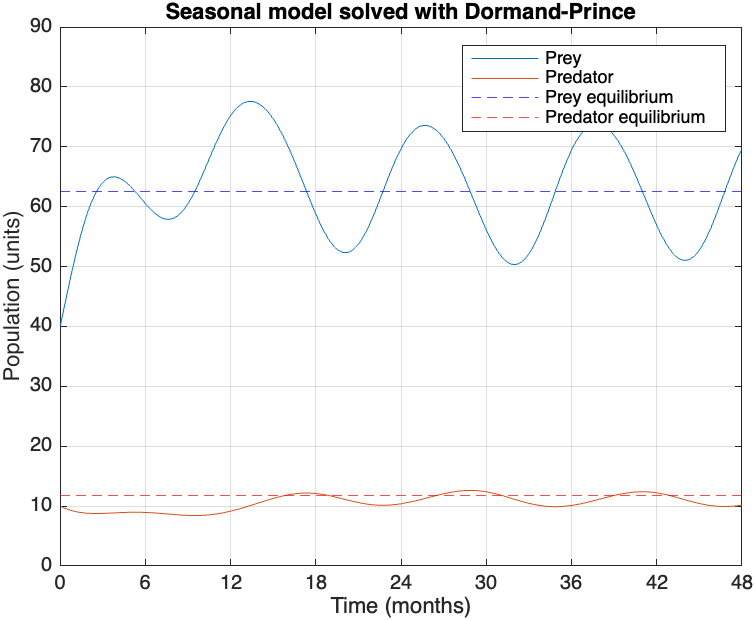

### Another seasonal variation

If more constants are set to change with seasons, interesting dynamics can be found. For example, predator rate can be set to vary with season (offsetted in respect to growth rate), while keeping its time average the same. Thus, bigger oscillations can be seen, while keeping the non autonomous equilibrium points as the point the values hover around. By taking

$$
d(t)=d\left(1+\alpha\cos\left(\frac{2\pi(t+\phi)}{12}\right)\right)
$$

and an offset of 3 months (winter-spring), the following results are obtained.

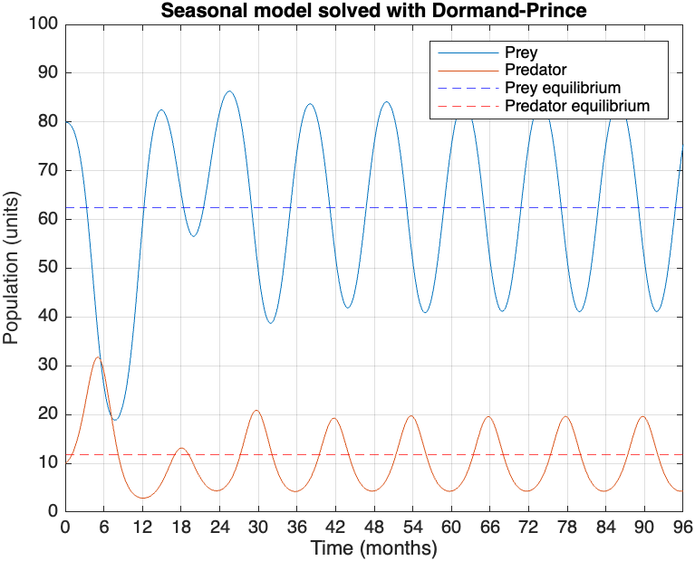

When strong seasonality is paired with high growth and depredation rates, multi-year patterns can appear. In the following simulation, the high predator mortality during winter and high prey growth rate during spring lead to big prey populations, which makes predator populations grow rapidly, leading to prey near-extintion, and after some months, predator near-extintion. These type of aperiodic, multi year patterns can appear when out of phase non autonomous terms are added to the models.

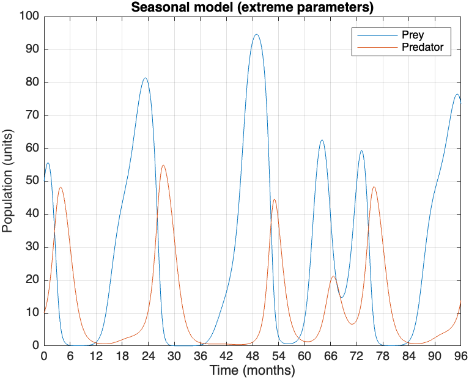

## Reaction-difussion model

This section will focus on spatial models for the predator-prey problem. Therefore, instead of finding the values for the functions $x_1(t),x_2(t)$, functions for the predator and prey concentration in space and time will be found. To avoid confusion with the spatial coordinates, the prey and predator populations will be respectively represented by

$$
\begin{matrix}
P(x,y,t) \\
Z(x,y,t)
\end{matrix}
$$

The problem will be restricted to $\Omega=[0,1]\times[0,1]\subset\mathbb R^2$, and will simulate local interaction between predator and prey (using any of the previous models), as well as spatial difussion (from areas with higher concentration to ones with lower). Thus, the problem will become a PDE system given by

$$
\begin{matrix}
\frac{dP}{dt}=f(P,Z)+ D_P\nabla^2 P \\
\frac{dZ}{dt}=g(P,Z)+ D_Z\nabla^2 Z
\end{matrix}
$$

with $D_P,D_Z\in\mathbb R^+$. Due to the geometry of the spatial domain, finite differences on a regular grid will be used. For more complex geometries, other methods such as finite elements would be used, but the problem would become more complex.

In order to numerically aproximate the Laplacian, taking $n_x,n_y$ points on each axis, the second order 5 point stencil will be used, given by

$$
\nabla^2 F_{i,j}\approx\frac{F_{i+1,j}-2F_{i,j}+F_{i-1,j}}{\Delta x^2}+\frac{F_{i,j+1}-2F_{i,j}+F_{i,j-1}}{\Delta y^2}
$$

where $\Delta x=\frac1{n_x-1},\,\Delta y=\frac1{n_y-1}$. Furthermore, no-flux boundary conditions will be used, to assume no interaction between the boundary and the outside. This can be mathematically represented as

$$
\frac{\partial P}{\partial\hat n}=\frac{\partial Z}{\partial\hat n}=0
$$

In this finite differences grid, it will be implemented by adding ghost points outside the grid that cancel the Laplacian term, for example $P_{0,j}=P_{2,j}$.

### Explicit Euler

Once the finite differences grid for the Laplacian is correctly defined, the next step is to find a suitable time integrator to numerically aproximate the time evolution. By using this discretization, the PDE problem can be interpreted as $n_xn_y$ different IVP, one per aproximation node. The simplest integrator, as with regular ODEs is explicit Euler. The general expression will be

$$
\begin{matrix}
P^{n+1}=P^n+\Delta t(f(P^n,Z^n)+D_PLP^n) \\
Z^{n+1}=Z^n+\Delta t(g(P^n,Z^n)+D_ZLZ^n)
\end{matrix}
$$

where $f,g$ are both reaction function, $L$ is the discrete Laplacian and $D_P,D_Z$ are the difussion constants. The main drawback of using this time integrator, is that there is a maximum timestep size for the diffusion to be numerically stable. This boundary is known as the CFL conditon (proof is omitted). Thus, implicit methods will be preferred, as this limitation won't apply. For explicit Euler and central differences (5 point Laplacian stencil), the condition for stability is

$$
\Delta t\le \frac1{2D}\left(\frac1{\Delta x^2}+\frac1{\Delta y^2}\right)^{-1}
$$

This method can be implemented, in order to get the `EulerDiffusion.m` program. This solver is tailored for this problem (2 variables, $[0,1]\times[0,1]$ domain,...), so it isn't a generally aplicable solver, as implementing it would be more complex, and out of the scope of this repository. This program is meant to be readable and easily understandable. Furthermore, in order to speed up simulations and tests, the `EulerDiffusionSparce.m` is also available. It implements the same method, but takes advantage of the fact that the Laplacian is a sparce matrix, in order to speed up calculations using Kronecker products. However, due to the fact that is flattens and then reshapes the grid, some readability is lost.

#### Euler numerical testing

The `SpatialDiffusionEuler.mlx` notebook documents various simulations with using Explicit Euler to simulate reaction-diffusion. The notebook also contains animated heatmaps to show population over time. As for static content, spatial averages over time, and spacetime diagrams of horizontal bands will be used. Generally, spatial averages will behave similarly to the non spatial model, specially when using randomly perturbated maps as an initial condition, as diffusion will smooth out the results. For example, for Holling Type II and the same conditions as in previous sections, the results are the following

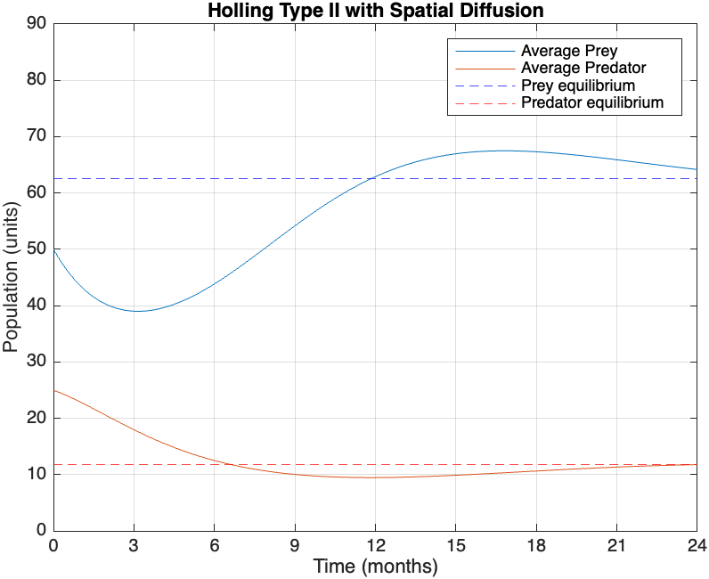

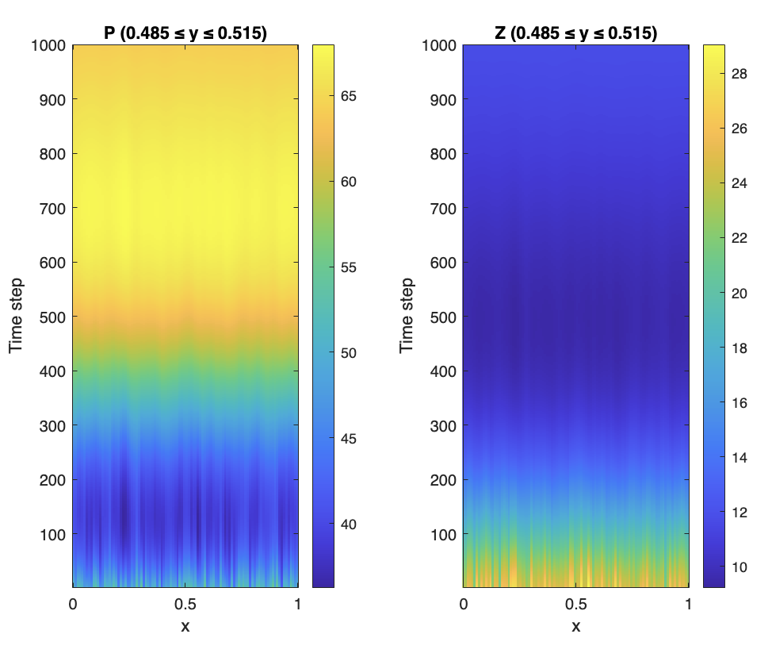

Furthermore, if initial conditons other than random perturbations over stable values are used, interesting dynamics can be found. For example, if a predator patch is placed in the center, it will lead to local prey extintion, then expand, and slowly smooth over the rest of the grid.

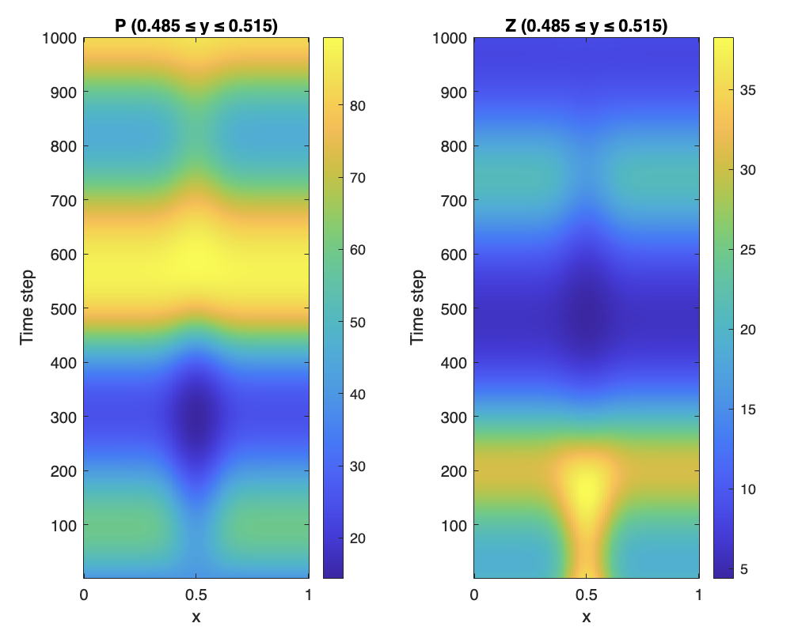

### Crank-Nicolson

While explicit Euler is the simplest integrator, its restrictive stability condition makes it impractical for diffusion-dominated problems. However, the Crank-Nicolson method is unconditionally stable for linear diffusion, meaning there is no timestep restriction based on diffusion coefficients or grid spacing.

The main difference is that the Crank-Nicolson scheme treats the diffusion terms implicitly while keeping the reaction terms explicit. The general expression is

$$
\begin{matrix}
P^{n+1}=P^n+\Delta t\left(f(P^n,Z^n)+D_P\frac{LP^n+LP^{n+1}}{2}\right) \\
Z^{n+1}=Z^n+\Delta t\left(g(P^n,Z^n)+D_Z\frac{LZ^n+LZ^{n+1}}{2}\right)
\end{matrix}
$$

Rearranging terms to isolate the unknown values at time $n+1$ gives the linear system

$$
\begin{matrix}
\left(I-\frac{\Delta t D_P}{2}L\right)P^{n+1}=P^n+\frac{\Delta t D_P}{2}LP^n+\Delta t f(P^n,Z^n) \\
\left(I-\frac{\Delta t D_Z}{2}L\right)Z^{n+1}=Z^n+\frac{\Delta t D_Z}{2}LZ^n+\Delta t g(P^n,Z^n)
\end{matrix}
$$

where $I$ is the identity matrix. Unlike explicit Euler, which directly computes $P^{n+1}$ and $Z^{n+1}$, Crank-Nicolson requires solving a linear system at each timestep. The matrices $M_P = I-\frac{\Delta t D_P}{2}L$ and $M_Z = I-\frac{\Delta t D_Z}{2}L$ are sparse and time-independent, allowing them to be factorized once and reused for all timesteps, making the scheme computationally efficient.

The key advantage of Crank-Nicolson over explicit Euler is the removal of the diffusion stability restriction. For explicit Euler and central differences (5-point Laplacian stencil), the condition for stability is

$$
\Delta t \le \frac{1}{2D}\left(\frac{1}{\Delta x^2}+\frac{1}{\Delta y^2}\right)^{-1}
$$

Crank-Nicolson imposes no such bound for diffusion terms. However, the explicit treatment of reactions $f$ and $g$ (using Euler in this case), may still introduce stability restrictions if the reactions are stiff.

This method is implemented in `CrankNicolsonDiffusion.m`. As with Euler, the solver is tailored for this specific problem (2 variables, $[0,1]\times[0,1]$ domain, Neumann boundary conditions), so it isn't a generally applicable solver, as implementing a general-purpose implicit PDE solver would be significantly more complex and out of the scope of this repository. This program is meant to be readable and easily understandable while demonstrating the key ideas of implicit time integration.

This implementation constructs the 2D Laplacian $L$ as a sparse matrix using Kronecker products, $L = I_y \otimes L_x + L_y \otimes I_x$, where $L_x$ and $L_y$ are the 1D Laplacian matrices with Neumann boundary conditions. The matrices $M_P$ and $M_Z$ are then formed and factorized using LU decomposition. For each timestep, the right-hand side is assembled from the current solution and reaction terms, then the linear systems are solved via forward/backward substitution. This approach maintains the sparsity of the problem while avoiding the need to solve from scratch at each timestep.

The main trade-off compared to explicit Euler is the increased complexity per timestep: explicit Euler only requires matrix-vector multiplications, while Crank-Nicolson requires solving linear systems. However, for diffusion-dominated problems where explicit Euler would need impractically small timesteps, the implicit method becomes faster overall despite the higher per-step cost. For problems where reactions are the primary source of stiffness, fully implicit treatment of both diffusion and reactions would be necessary, but that requires solving nonlinear systems.

#### Crank-Nicolson numerical testing

This solvers behavior is quualitatively indistinguishable from Euler, however, on problems where Euler collapses due to diffusion being too quick, it stays numerically stable. For example, if Holling Type II is used, but the timestep is increased (less steps) and diffusion coefficients are increased, this can be clearly seen.

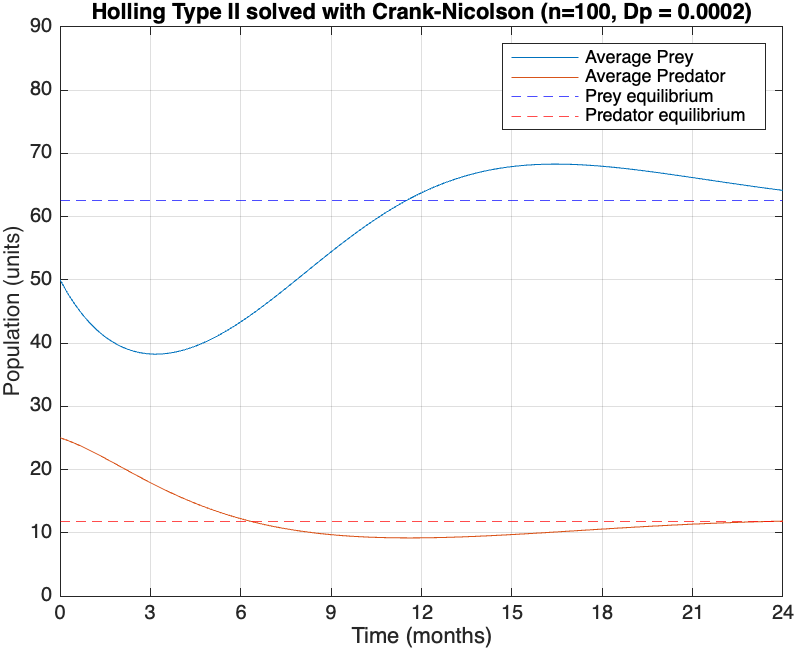

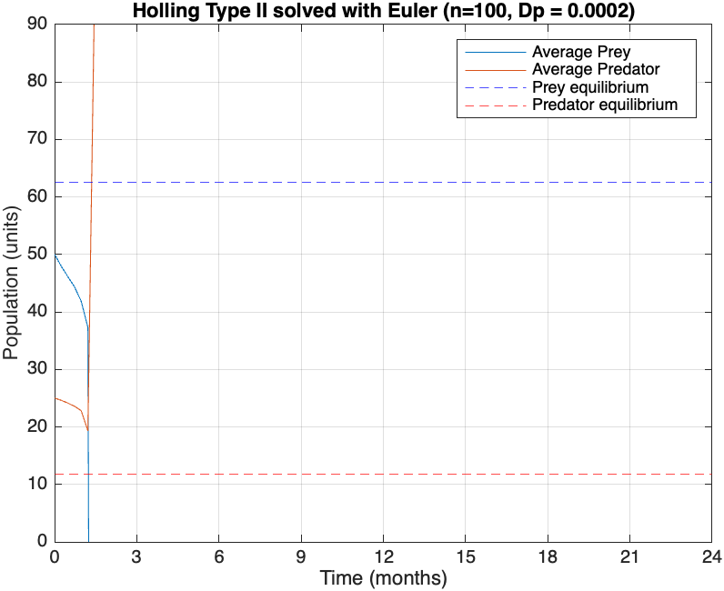

### Alternating Direction Implicit (ADI)

While Crank-Nicolson removes the diffusion stability restriction, it requires solving a large 2D linear system at each timestep. The Alternating Direction Implicit (ADI) method offers a compromise: it retains unconditional stability for linear diffusion but replaces the 2D solve with a sequence of cheaper 1D solves.

The ADI method splits each timestep into two substeps. In the first substep, diffusion is treated implicitly in the $x$-direction and explicitly in the $y$-direction. In the second substep, the roles are reversed:

$$
\begin{matrix}
\text{Step 1:}&\quad \left(I-\frac{\Delta t D_P}{2}L_x\right)P^{*} &=& \left(I+\frac{\Delta t D_P}{2}L_y\right)P^n + \Delta t f(P^n,Z^n) \\
&\quad \left(I-\frac{\Delta t D_Z}{2}L_x\right)Z^{*} &=& \left(I+\frac{\Delta t D_Z}{2}L_y\right)Z^n + \Delta t g(P^n,Z^n) \\[10pt]
\text{Step 2:}&\quad \left(I-\frac{\Delta t D_P}{2}L_y\right)P^{n+1} &=& \left(I+\frac{\Delta t D_P}{2}L_x\right)P^{*} \\
&\quad \left(I-\frac{\Delta t D_Z}{2}L_y\right)Z^{n+1} &=& \left(I+\frac{\Delta t D_Z}{2}L_x\right)Z^{*}
\end{matrix}
$$

where $L_x$ and $L_y$ are the 1D Laplacian operators in the $x$ and $y$ directions, respectively. The reaction terms $f$ and $g$ are only evaluated in the first substep (explicitly), following the same pattern as Crank-Nicolson.

The main differnece is that each substep requires solving many small tridiagonal systems instead of one large sparse system. Step 1 solves $N_y$ independent systems of size $N_x$ (one for each $y$-line), while Step 2 solves $N_x$ independent systems of size $N_y$ (one for each $x$-line). The computational cost per timestep drops from $O((N_x N_y)^3)$ for a direct 2D solve to $O(N_x N_y \cdot \min(N_x, N_y))$ for ADI.

Like Crank-Nicolson, ADI is unconditionally stable for linear diffusion problems. The matrices $I-\frac{\Delta t D_P}{2}L_x$, $I-\frac{\Delta t D_Z}{2}L_x$, $I-\frac{\Delta t D_P}{2}L_y$, and $I-\frac{\Delta t D_Z}{2}L_y$ are time-independent and tridiagonal. Each can be factorized once (using LU decomposition) and reused for all timesteps and all lines within each substep.

This method is implemented in `ADIDiffusion.m`. For each timestep:

1. The reaction terms are computed explicitly from the current solution
2. **Step 1:** For each $y$-line, the right-hand side $P^n + \frac{\Delta t D_P}{2}L_y P^n + \Delta t f$ is assembled and the tridiagonal system is solved to obtain $P^*$
3. **Step 2:** For each $x$-line, the right-hand side $P^* + \frac{\Delta t D_P}{2}L_x P^*$ is assembled and the tridiagonal system is solved to obtain $P^{n+1}$
4. The same procedure is applied to $Z$

For typical grid sizes ($N_x, N_y \gg 100$), ADI can be orders of magnitude faster than solving the full 2D system directly, while maintaining identical stability and second-order accuracy. This makes ADI particularly attractive for large-scale diffusion problems where Crank-Nicolson would be computationally prohibitive.

As with the other solvers presented here, this implementation is tailored to the specific problem (2 variables, $[0,1]\times[0,1]$ domain, Neumann boundary conditions) and is intended to be readable and educational rather than a general-purpose PDE solver. The ADI pattern, however, generalizes straightforwardly to other domains and boundary conditions by modifying the 1D Laplacian matrices $L_x$ and $L_y$.

#### ADI numerical testing

As with other solvers, it is qualitatively indistinguishable, showing a tendency to stabilize over time on these models. For example, when solving the non-autonomous model, with only 100 steps, the results are the following.

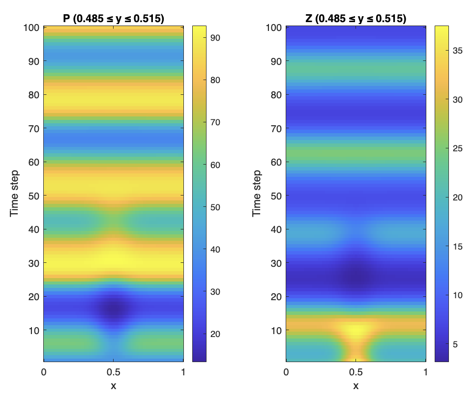

### Diffusion methods comparison

The different methods provide benefits for different situations. The Explicit Euler scheme is much faster than both CN and ADI, making it more suitable when high values of $n$ will be used. However, when diffusion requires prohibitively high numbers of steps, the other methods, depdespite being much less efficient per timestep, will be overall much faster, specially if memory requirements are to be considered. On the other side, the sparce implementation of Euler is, as expected, faster, due to the efficiency increase of storing only relevant components as opposed to big, mostly empty matrices.

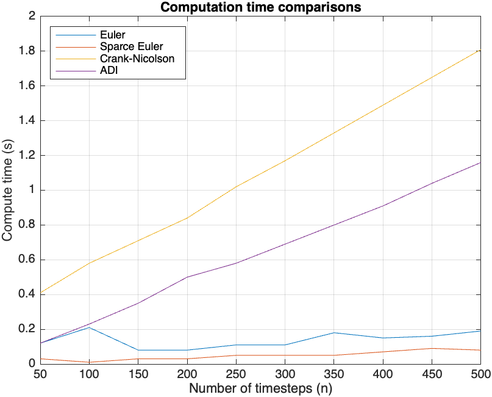
